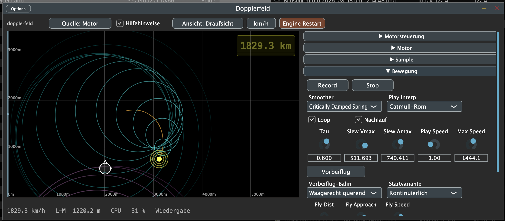

# Dopplerfeld

Audio-Plugin (AU/VST3/Standalone) für macOS, das den akustischen
Dopplereffekt physikalisch nachstellt – inklusive Überschall und Mach-Kegel.
Eine Schallquelle **M** und ein Hörer **L** (mit Kopf-Orientierung) auf einer
Feldfläche, die eine reale Modellgröße von 1 bis 10.000 Metern darstellt. Der
Ton entsteht aus echter Laufzeitberechnung (retarded time), nicht aus einer
Doppler-Formel als Abkürzung.



## Download

Fertig gebaute (Mac) Standalone-App, VST3 und AU liegen unter
[Releases](../../releases) – herunterladen, entpacken, benutzen. Kein Xcode,
kein CMake nötig.

**macOS meldet beim ersten Start "kann nicht geöffnet werden, da der
Entwickler nicht verifiziert werden kann"** (die Builds sind unsigniert,
kein zahlungspflichtiges Apple-Entwicklerkonto dahinter). Abhilfe: im Finder
mit Rechtsklick → Öffnen starten (statt Doppelklick), oder im Terminal:

```
xattr -dr com.apple.quarantine /Pfad/zur/Dopplerfeld.app
```

## Features

- Freie Bewegung von Quelle und Hörer per Maus, inklusive Höhe (z-Achse) in
  der perspektivischen Ansicht
- Bodenreflexion und bis zu zwei frei platzierbare Wände (Spiegelquellen),
  wahlweise mit einer zusätzlichen, stabilitätsgeprüften Reflexionsgeneration
- Zwei Vorbeiflug-Generatoren (geradlinig durch die Tiefe / waagerecht
  querend) mit einstellbarem Tempo und zwei Startarten
- Bewegungsaufzeichnung und -wiedergabe, mehrere Glättungsverfahren
- Bis zu 3 unabhängige Klangquellen plus bis zu 20 günstige Klone
  ("Schrot"-Schwarm) mit CPU-Meter, Automatik und Notaus
- Optionale N-Wellen-Synthese für den Überschallknall
- Motor-Generator und Sample-Player als Klangquelle

## Bauen aus dem Quellcode

Für Entwicklung/Debugging, nicht nötig für reine Nutzung (siehe Download
oben).

```
git clone https://github.com/3Dietrich/JUCE.git ~/Documents/JUCE   # oder eigener JUCE-Checkout
git clone <dieses-repo>
cd Dopplerfeld
cmake -B build -DJUCE_DIR=~/Documents/JUCE
cmake --build build --config Release --target Dopplerfeld_Standalone -j 4
cd build && ctest --output-on-failure     # solver_check + load_check
```

`-DJUCE_DIR` zeigt auf einen lokalen JUCE-Checkout (Version 8.0.6 getestet);
ohne die Angabe wird `~/Documents/JUCE` angenommen.

## Architektur

Siehe [ARCHITEKTUR.md](ARCHITEKTUR.md) für das Schichtenmodell, Kernklassen
und den aktuellen Stand.

## Lizenz

[GPLv3](LICENSE) – bedingt durch die Lizenz von [JUCE](https://juce.com) in
der kostenlosen Open-Source-Stufe.
