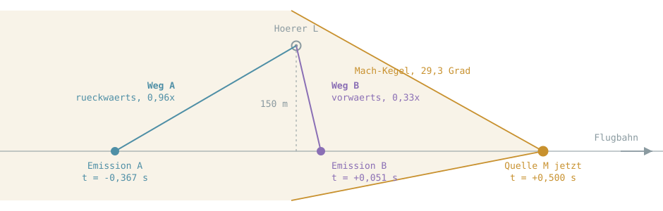

# Warum klingt es anders als erwartet

Überschall-Vorbeiflüge klingen in Dopplerfeld anders, als man es erwartet: nach
dem Knall bleibt der Klang kurz und wirkt, als liefe er rückwärts. Ein Teil
davon ist echte Physik und gehört so. Ein Teil ist ein Fehler.

Dieses Dokument trennt beides, damit man beim Hören weiß, worüber man sich
wundern soll und worüber nicht.

Alle Zahlen sind für **Mach 2,04** (700 m/s bei 343 m/s Schallgeschwindigkeit)
in **150 m** seitlichem Abstand gerechnet.

## Die Geometrie in einem Augenblick



Das Bild zeigt 0,5 Sekunden nach der dichtesten Annäherung. Der Hörer liegt
innerhalb des Kegels und empfängt in diesem Moment Schall von **zwei** Punkten
der Bahn gleichzeitig: einem weit vor der Annäherung und einem kurz danach.

Die Kegelfläche selbst hat ihn bei 0,381 s überstrichen. Das war der Knall.

Der Grund für die zwei Wege steht in der Retarded-Time-Gleichung selbst:

```
c * (t_h - t_e) = |L - M(t_e)|
```

Bei Unterschall hat sie genau eine Lösung, bei Überschall innerhalb des Kegels
zwei. Beide sind gleichberechtigte Hörwege, sie werden addiert. Genau so ist es
in [`RetardedTimeSolver`](../Source/Physics/RetardedTimeSolver.h) und
[`PropagationPath`](../Source/Physics/PropagationPath.h) gebaut, ohne Sondercode
für den Überschallfall.

## Die zwei Wege laufen auseinander

Ab der Kegelankunft wandern die beiden Lösungen in entgegengesetzte Richtungen
durch die Quellgeschichte.

**Weg A läuft rückwärts**, mit 0,96-facher Geschwindigkeit, also fast in
Echtzeit. Er arbeitet die gesamte Anflugphase rückwärts ab und kommt nie an ein
Ende, solange die Quelle Geschichte hat.

**Weg B läuft vorwärts, auf ein Drittel verlangsamt** (Faktor 0,33). Das sind
gut anderthalb Oktaven tiefer. Er folgt der Quelle beim Wegfliegen.

Direkt an der Kegelfläche ist der Faktor beider Wege `±281`. In dem Augenblick
wird fast eine halbe Minute Quellgeschichte in wenige Millisekunden gepresst.
Das ist die Kaustik, und das ist der Grund, warum der Knall so laut ist: nicht
weil dort mehr Energie entsteht, sondern weil dort sehr viel Zeit auf sehr wenig
Zeit fällt.

Dass Weg A rückwärts läuft, **hört man normalerweise nicht.** Zeitumgekehrtes
Rauschen klingt wie vorwärts laufendes; unser Gehör hat keinen Richtungssinn für
die Zeitachse. Hörbar wird die Umkehr erst bei einem Signal mit deutlicher
Hüllkurven-Asymmetrie, also bei einem Sample mit erkennbarem Anschlag. Und dann
ist sie trotzdem richtig.

## Wie lange es dauern muss

Amplitude beider Wege aus `1/(R * sqrt((1-M_r)² + eps²))`, bezogen auf den
Spitzenwert an der Kegelfläche:

| Zeit nach Annäherung | Abstand Weg A | Pegel |
|---|---:|---:|
| 0,381 s (Knall) | 172 m | 0,0 dB |
| 0,400 s | 207 m | -23,8 dB |
| 0,500 s | 297 m | -32,4 dB |
| 0,750 s | 481 m | -38,4 dB |
| 1,000 s | 656 m | -41,5 dB |
| 2,000 s | 1337 m | -48,0 dB |
| 4,000 s | 2686 m | -54,1 dB |
| 8,000 s | 5378 m | -60,2 dB |

Zwei Dinge stehen da drin.

Erstens fällt der Pegel unmittelbar nach dem Knall **sehr** steil, fast 24 dB in
19 Millisekunden. Das ist die zusammenbrechende Fokussierung.

Zweitens geht es danach in einen langen, flachen Ausklang über, rund 20 dB pro
Zehnerpotenz Zeit. Nach acht Sekunden ist immer noch etwas da.

Ein echter Überschallüberflug klingt genau so: Knall, dann schlagartig viel
leiser, dann ein anhaltendes Rollen, das lange ausklingt. **Nichts bricht ab.**

## Was Physik ist und was nicht

| | |
|---|---|
| **Physik** | Der rückwärts laufende Weg. Er ist wirklich da und meist unhörbar. |
| **Physik** | Der steile Abfall direkt nach dem Knall, rund 24 dB in 19 ms. |
| **Physik** | Der Knall selbst als eigene, additive Druckwellen-Schicht (N-Welle). |
| **Fehler** | Dass danach nichts mehr kommt. Der lange Ausklang fehlt. |
| **Fehler** | Das Zerhacken: Zweige sterben und werden neu geboren, im schlimmsten Fall über 200 Mal pro Sekunde. |

## Die Anti-Klick-Hüllkurve

Jeder Zweig hat einen eigenen Faktor `env` zwischen 0 und 1, mit dem sein
**gesamter** Beitrag multipliziert wird. Meldet der Löser den Zweig, läuft `env`
linear auf 1. Meldet er ihn nicht mehr, läuft `env` auf 0.

Der Grund: ein Zweig, der von einem Sample auf das nächste erscheint oder
verschwindet, ist ein Sprung im Ausgangssignal. Ein Sprung ist Energie über die
gesamte Bandbreite, also ein Knacks. Die Rampe verteilt ihn über eine
Millisekunde.

Darin liegt aber auch der Fehler. Die Rampe wurde gebaut, um einen Knacks zu
verhindern, und macht das Gegenteil. Gemessen stirbt ein Zweig im Überschall mit
`env` im Mittel bei 0,71 und im Maximum bei 1,000, also bei vollem Pegel. Die
Rampe schneidet ihn dann in einer Millisekunde ab. Das ist kein Ausblenden, das
ist ein Schnitt.

Die N-Welle ist von dieser Hüllkurve inzwischen entkoppelt: eine ausgelöste
Stoßfront ist unterwegs, unabhängig davon, ob der Löser danach noch eine Wurzel
für diesen Hörweg findet.

## Der Stand messen statt hören

`load_check` misst das alles, damit man nicht hinhören muss, um zu wissen ob es
besser geworden ist. Pro Szenario:

```
Zweig-Tode      392 (  78.4 /s) | env beim Tod Ø 0.709 max 1.000 | env >= 0,5:  64.3 %
davon an der Kaustik 124 ( 31.6 %) | Ausklang tau Ø 31.339 ms max 100.000 ms
HARTE ABBRUECHE 182 von 252 lauten Toden ( 72.2 %)
Ursachen: Nachfuehrung verloren 4 | neue Identitaet 405 | Wurzeln verworfen 155
```

Das Kriterium, an dem der Test hängt:

> Ein Zweig, der mit `env >= 0,5` stirbt, darf nicht in unter 2 ms auf null
> gehen.

Solange dort etwas anderes als null steht, ist der Abbruch noch da. Das Szenario
heißt `Bremsflug` und fliegt dieselbe Bahn zweimal, einmal mit Mach 2,04 und
einmal mit Mach 0,87, damit der Unterschall-Lauf beweist, dass Bahn und Messung
selbst keinen Sturz erzeugen.
